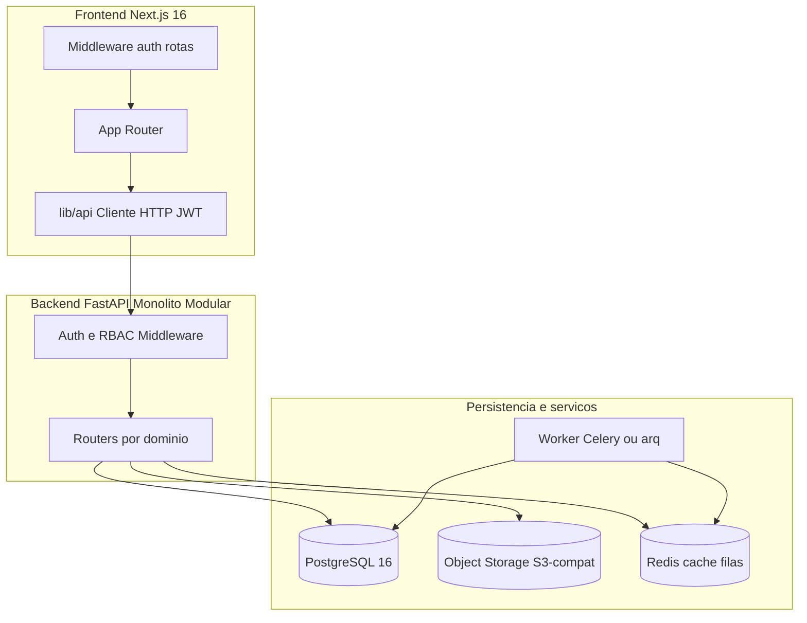
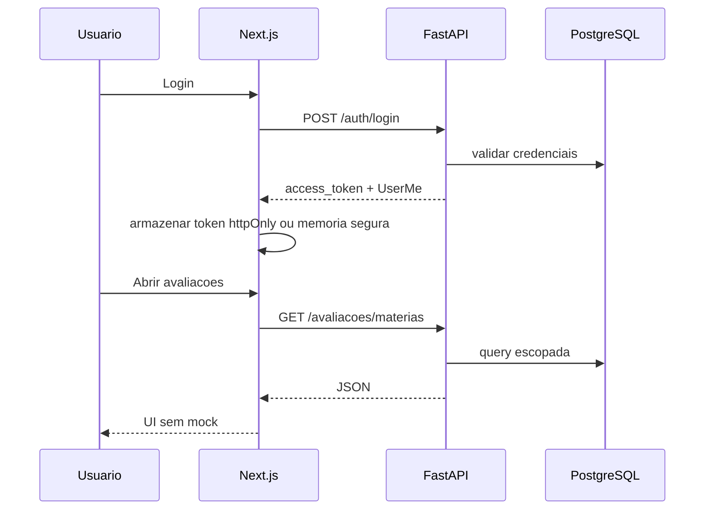

# Arquitetura de tecnologia

## Visão geral



## Stack

| Camada | Tecnologia | Versão alvo |
|--------|------------|-------------|
| Frontend | Next.js (App Router), React, TypeScript | 16 / 19 |
| UI | Tailwind CSS 4, Radix/shadcn | — |
| Gráficos | Recharts | — |
| Backend | FastAPI, Pydantic v2, SQLAlchemy 2.x | Python 3.12+ |
| Banco | PostgreSQL + JSONB | 16+ |
| Migrations | Alembic | — |
| Auth | JWT access + refresh; hash argon2/bcrypt | — |
| Arquivos | Presigned upload → blob storage | S3-compat |
| Jobs | Celery + Redis, RQ ou arq | IA, correção, expiração |
| Container | Docker Compose | `docker compose up` |

## Monólito modular (backend)

O núcleo de negócio permanece em um **único deploy FastAPI** com controllers + services:

```
backend/app/
├── controllers/          # Configuracoes, Avaliacoes, Conteudo, Comunicados, Dashboard
├── services/             # Regras de negócio (1 service por controller)
├── schemas/              # DTOs Pydantic v2
├── api/deps.py           # JWT, CurrentUser, require_perfis
└── models/               # SQLAlchemy (F0)
```

| Controller / service | Responsabilidade |
|----------------------|------------------|
| `Configuracoes*` | Auth, admin, cadastros, turmas/alunos |
| `Avaliacoes*` | Hierarquia, questões, fluxo aluno (sem chat IA) |
| `Conteudo*` | Pastas, materiais, presign stub |
| `Comunicados*` | Inbox, publicação, leitura |
| `Dashboard*` | Resumo, busca, notificações |
| `IAController` (pendente) | Chat editor + relatório IA |

Serviços satélites (filas, LLM, blob S3) evoluem independentemente sem fragmentar o domínio transacional no MVP.

## Convenções da API

| Tópico | Regra |
|--------|--------|
| Base URL | `/api/v1` |
| IDs | UUID string no JSON |
| Tempo | `timestamptz` UTC no banco; exibição no fuso do cliente |
| Multi-tenant | Toda query filtra `instituicao_id` do token (exceto super admin) |
| Erros | Envelope `{ code, message, details? }` |
| Paginação | `cursor` ou `page` + `page_size` (máx. 100) |
| Auth | `Authorization: Bearer <access_token>` |

## Frontend — estrutura atual e alvo

### Atual (`frontend/`)

```
app/
  (app)/layout.tsx          # Shell: BarraLateral + Cabecalho
  (app)/conteudo/
  (app)/avaliacoes/         # ProvedorAvaliacoes (mock)
  (app)/comunicados/
  (app)/dashboard/
componentes/
  layout/                   # barra-lateral, cabecalho
  modulos/                  # modulo-* (mocks)
lib/
  avaliacoes/dados.ts       # Seed mock
```

### Alvo (incremental)

```
app/
  login/
  (app)/                    # Professor e administrador
  (aluno)/                  # Layout reduzido
  configuracoes/            # Admin institucional
  super-admin/              # Cross-tenant
lib/
  api/
    client.ts               # fetch + interceptors JWT
    auth.ts
    avaliacoes.ts
    ...
middleware.ts               # Guard de rotas por perfil
```

Variável de ambiente: `NEXT_PUBLIC_API_URL` (ver [frontend/.env.example](../frontend/.env.example)).

Build: `output: 'standalone'` em [frontend/next.config.mjs](../frontend/next.config.mjs) para Docker.

## Deploy (Docker Compose)

| Serviço | Porta |
|---------|-------|
| `frontend` | 3000 |
| `db` (PostgreSQL) | 5432 |
| `backend` | 8000 |

Subir stack completa:

```bash
docker compose up
```

O serviço `backend` referencia `./backend` — ver [backend/README.md](../backend/README.md) e [07-api-contrato-backend.md](./07-api-contrato-backend.md).

## Segurança (Zero-Trust resumido)

- Validação de token e perfil **antes** de handlers de negócio
- Testes de IDOR: ID válido de outra instituição → 404 ou 403
- Aluno/responsável: sem mutação pedagógica (RF-002)
- Super admin: auditoria de ações sensíveis (criar/desativar instituição)
- TLS em produção; secrets via env, nunca no repositório

## Integração frontend ↔ backend



Estratégia de migração: substituir `ProvedorAvaliacoes` e arrays locais módulo a módulo (F3–F7), mantendo tipos TypeScript alinhados aos DTOs Pydantic.

## Referências

- Modelo de dados: [04-modelo-de-dados.md](./04-modelo-de-dados.md)
- Contrato REST: [07-api-contrato-backend.md](./07-api-contrato-backend.md)
- RNFs: [05-requisitos-funcionais.md](./05-requisitos-funcionais.md#requisitos-não-funcionais-rnf)
