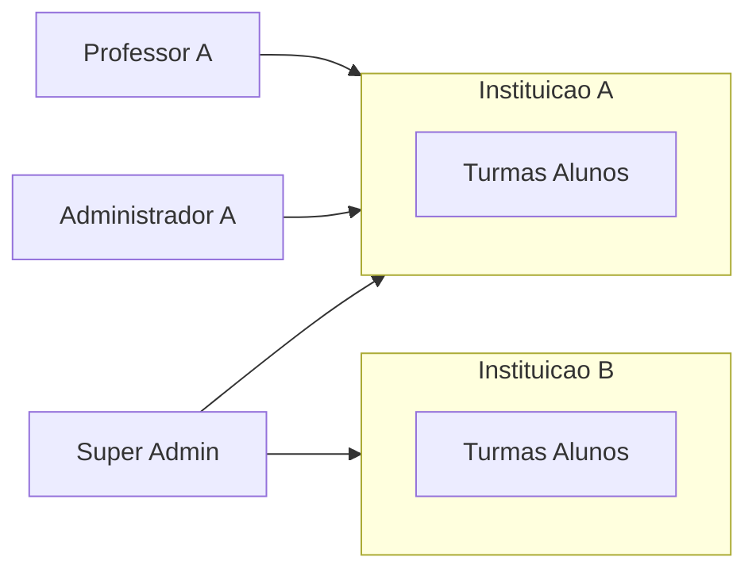

# Domínio, entidades e RBAC

## Grafo referencial (persistência alvo)

```
Instituicao
  ├── Turma (professor_titular opcional)
  │     └── Matricula ← Aluno
  ├── Usuario_Conta (tipo_perfil)
  │     ├── Professor (1:1)
  │     ├── Aluno (1:1)
  │     └── Responsavel (1:1)
  ├── Materia_curricular → Assunto → Pasta_Avaliacoes → Avaliacao → Questao
  │     └── Submissao ← Aluno → Resposta_questao → Relatorio_IA
  ├── Pasta_Conteudo → Material_estudo
  └── Comunicado → Comunicado_destinatario / Comunicado_leitura
```

**Aluno ↔ Responsável:** tabela `aluno_responsavel` (N:N) com `responsavel_principal` para roteamento de alertas críticos.

**Regra MVP de coorte:** no máximo uma matrícula **ativa** por aluno (índice único parcial).

## Cardinalidades de negócio

| Relação | Cardinalidade MVP | Notas |
|---------|-------------------|--------|
| Instituição → Turma | 1:N | Raiz de tenant |
| Professor → Turma | 1:N (titular) | Futuro: N:N via `turma_professor` |
| Turma → Aluno | N:N via Matricula | Situação ativa/encerrada |
| Responsável → Aluno | 1:N | Vários dependentes |
| Avaliação → Submissão | 1 por aluno | UNIQUE `(avaliacao_id, aluno_id)` |

## Perfis de usuário

Enum `tipo_perfil` em `usuario_conta`:

| Valor | Escopo | Descrição |
|-------|--------|-----------|
| `super_admin` | **Cross-tenant** | Operador da plataforma; `instituicao_id` **NULL** |
| `administrador` | Uma instituição | Diretor/dono; acesso total na escola |
| `professor` | Turmas/instituição vinculadas | CRUD pedagógico |
| `responsavel` | Alunos vinculados | Somente leitura analítica e comunicados |
| `aluno` | Próprio + turma | Consumo e provas |

### Super Admin (`super_admin`)

- Lista e gerencia **instituições** (criar, editar, desativar)
- Consulta **professores** e **turmas** de qualquer escola (filtro opcional por `instituicao_id`)
- **Não** edita provas, questões ou comunicados pedagógicos (não substitui professor)
- Queries sem filtro de tenant quando explícito; ações de escrita em cadastro global auditadas

### Administrador (`administrador`)

- Tudo o que o **professor** faz nos módulos pedagógicos **mais** módulo **Configurações**
- CRUD: professores, alunos, responsáveis, turmas, matrículas, vínculos aluno–responsável
- Vê dashboard e comunicados no escopo da instituição (política: mesmo escopo do professor com visão ampla de turmas)

### Professor (`professor`)

- CRUD: matérias, assuntos, pastas, avaliações, questões, materiais, comunicados
- Publicar/encerrar avaliações; chat IA no editor
- Dashboard e relatórios IA dos alunos das suas turmas

### Responsável (`responsavel`)

- GET dashboard (dependentes), comunicados destinados, relatórios IA
- Sem criação de conteúdo, provas ou comunicados institucionais

### Aluno (`aluno`)

- GET materiais autorizados
- GET/POST submissões em avaliações **publicadas** dentro do prazo
- Aba dedicada **Minhas provas** (`/aluno/provas`)
- Sem ver rascunhos, gabarito antes da política de liberação, ou dados de outros alunos

## Matriz ação × perfil

Legenda: ✅ permitido · 👁 leitura · ❌ negado · ⚙ escopo restrito

| Ação | Super Admin | Administrador | Professor | Responsável | Aluno |
|------|:-----------:|:-------------:|:---------:|:-----------:|:-----:|
| Login / preferências | ✅ | ✅ | ✅ | ✅ | ✅ |
| CRUD instituição | ✅ | ❌ | ❌ | ❌ | ❌ |
| CRUD professor/aluno/turma | 👁 global | ✅ | ❌* | ❌ | ❌ |
| CRUD matéria/avaliação | ❌ | ✅ | ✅ | ❌ | ❌ |
| Publicar/encerrar prova | ❌ | ✅ | ✅ | ❌ | ❌ |
| Chat IA elaboração | ❌ | ✅ | ✅ | ❌ | ❌ |
| Submeter prova | ❌ | ❌ | ❌ | ❌ | ✅ |
| CRUD material didático | ❌ | ✅ | ✅ | ❌ | 👁 |
| Emitir comunicado | ❌ | ✅ | ✅ | ❌ | ❌ |
| Ler comunicado (inbox) | ❌ | ✅ | ✅ | 👁 | 👁 |
| Dashboard resumo | 👁 agregado | ✅ | ✅ | 👁 dependentes | ⚙ futuro |
| Relatório IA | ❌ | ✅ | ✅ | 👁 | 👁 próprio |
| Busca federada | 👁 | ✅ | ✅ | ⚙ | ⚙ |

\* Professor pode **ler** turmas/alunos do escopo via GET para montar destinatários; não cadastra usuários no MVP.

## Roteamento pós-login (frontend)

| `tipo_perfil` | Redirecionamento padrão |
|---------------|-------------------------|
| `super_admin` | `/super-admin` |
| `administrador` | `/dashboard` ou `/configuracoes` |
| `professor` | `/conteudo` (home atual) |
| `responsavel` | `/dashboard` |
| `aluno` | `/aluno/provas` ou `/conteudo` |

Middleware Next.js deve bloquear rotas fora do perfil (ex.: aluno em `/avaliacoes/*/editor`).

## RF-002 — Regras de mutação (API)

Implementar no middleware FastAPI **antes** dos handlers:

1. Extrair `usuario_id`, `tipo_perfil`, `instituicao_id` do JWT
2. Para `super_admin`, permitir rotas `/admin/*` e `/super-admin/*`; negar mutações pedagógicas de professor salvo política explícita
3. **Aluno:** apenas rotas `/aluno/*`, leitura de conteúdo/comunicados autorizados, PATCH submissão própria
4. **Responsável:** apenas GET em escopo de dependentes; PATCH leitura de comunicado/notificação
5. **Professor / administrador:** CRUD pedagógico; administrador adicionalmente `/cadastros/*`
6. Retornar **403** com `code: FORBIDDEN_PROFILE` em violações

## Ciclo de vida da avaliação (resumo)

| Estado | Professor/Admin | Aluno |
|--------|-----------------|-------|
| `rascunho` | Edita questões; não visível ao aluno | Não lista |
| `publicada` | Pode encerrar; editação de questões bloqueada (MVP) | Responde até `prazo_utc` ou encerramento |
| `encerrada` | Somente leitura; irreversível MVP | Sem nova submissão |

Validação de prazo: **sempre UTC no servidor** (RF-009).

## Isolamento multi-tenant



- Token de usuário institucional carrega `instituicao_id`
- Repositórios SQLAlchemy aplicam filtro obrigatório
- Super admin usa claim `is_super_admin: true` sem `instituicao_id` ou com escopo explícito na rota

## Referências

- Tabelas: [04-modelo-de-dados.md](./04-modelo-de-dados.md)
- API e matriz endpoint: [07-api-contrato-backend.md](./07-api-contrato-backend.md#apêndice-matriz-endpoint--perfil)
- Configurações operacionais: [08-configuracoes-sistema.md](./08-configuracoes-sistema.md)
