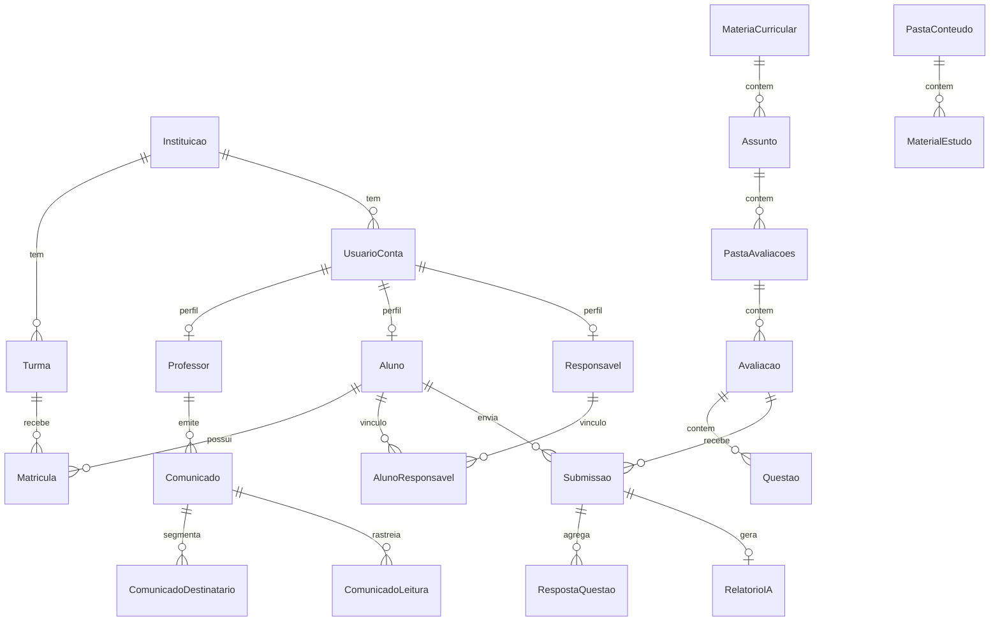

# Modelo de dados

Convenção: PK `id` UUID; FKs `*_id` UUID; colunas `snake_case`; timestamps `timestamptz` UTC.

## Diagrama ER (simplificado)



## Turma vs sala física

No cadastro operacional do produto, **“sala de aula”** mapeia para a entidade **`turma`** (coorte pedagógica: nome, ano letivo, turno, professor titular).

Se no futuro for necessário sala física (capacidade, prédio), adicionar:

```sql
-- Pós-MVP
sala (id, instituicao_id, nome, capacidade, ...)
turma.sala_id FK → sala.id  -- opcional
```

## Extensões em relação ao roadmap original

| Alteração | Detalhe |
|-----------|---------|
| `tipo_perfil` | Incluir `super_admin`, `administrador` além de `professor`, `aluno`, `responsavel` |
| `usuario_conta.instituicao_id` | **NULL** permitido apenas para `super_admin` |
| Email único | `UNIQUE (instituicao_id, lower(email))` — não global, exceto super admin |

---

## Tabelas (27 + extensões)

### Governança e acesso

#### `instituicao`
| Coluna | Tipo | Notas |
|--------|------|-------|
| id | UUID PK | |
| nome_fantasia | text NOT NULL | |
| documento_legal | text NULL | CNPJ opcional |
| configuracoes_jsonb | jsonb NULL | Políticas locais |
| criado_em, atualizado_em | timestamptz | |

#### `usuario_conta`
| Coluna | Tipo | Notas |
|--------|------|-------|
| id | UUID PK | |
| instituicao_id | UUID FK NULL | NULL só super_admin |
| email | citext NOT NULL | UNIQUE por instituição |
| senha_hash | text NOT NULL | |
| tipo_perfil | enum NOT NULL | Ver [03-dominio](./03-dominio-entidades-e-rbac.md) |
| status_conta | enum NOT NULL | ativa, suspensa, pendente_ativacao |
| nome_exibicao | text NOT NULL | |
| preferencias_ui | jsonb NULL | tema, idioma |
| criado_em, atualizado_em | timestamptz | |

#### `professor`
| Coluna | Tipo | Notas |
|--------|------|-------|
| id | UUID PK | |
| usuario_id | UUID FK UNIQUE NOT NULL | |
| registro_funcional | text NULL | |
| areas_especialidade | text NULL | |

#### `aluno`
| Coluna | Tipo | Notas |
|--------|------|-------|
| id | UUID PK | |
| usuario_id | UUID FK UNIQUE NOT NULL | |
| nome_social | text NULL | |
| data_nascimento | date NULL | |
| matricula_codigo | text NULL | Código interno escola |

#### `responsavel`
| Coluna | Tipo | Notas |
|--------|------|-------|
| id | UUID PK | |
| usuario_id | UUID FK UNIQUE NOT NULL | |
| grau_parentesco | text NULL | |
| telefone | text NULL | |

#### `aluno_responsavel`
| Coluna | Tipo | Notas |
|--------|------|-------|
| id | UUID PK | |
| aluno_id | UUID FK NOT NULL | |
| responsavel_id | UUID FK NOT NULL | |
| responsavel_principal | boolean DEFAULT false | |
| ordem_contato | int NULL | |
| UNIQUE (aluno_id, responsavel_id) | | |

#### `turma`
| Coluna | Tipo | Notas |
|--------|------|-------|
| id | UUID PK | |
| instituicao_id | UUID FK NOT NULL | |
| professor_titular_id | UUID FK NULL | → professor.id |
| nome | text NOT NULL | Ex.: "3º Ano A" |
| ano_letivo | text NOT NULL | Ex.: "2026" |
| turno | text NULL | manhã/tarde |
| criado_em, atualizado_em | timestamptz | |

#### `matricula`
| Coluna | Tipo | Notas |
|--------|------|-------|
| id | UUID PK | |
| aluno_id | UUID FK NOT NULL | |
| turma_id | UUID FK NOT NULL | |
| data_inicio | date NOT NULL | |
| data_fim | date NULL | |
| situacao | enum NOT NULL | ativa, encerrada, transferida |

**Constraint MVP:** índice único parcial — um aluno com no máximo uma matrícula `situacao = 'ativa'`.

---

### Avaliações (taxonomia e provas)

#### `materia_curricular`
| Coluna | Tipo | Notas |
|--------|------|-------|
| id | UUID PK | |
| instituicao_id | UUID FK NOT NULL | |
| professor_autor_id | UUID FK NOT NULL | |
| nome | text NOT NULL | |
| slug | text NULL | Rotas amigáveis |
| cor_token_ui | text NULL | |
| ordem | int NULL | |
| criado_em, atualizado_em | timestamptz | |

#### `assunto`
| Coluna | Tipo | Notas |
|--------|------|-------|
| id | UUID PK | |
| materia_id | UUID FK NOT NULL | |
| nome | text NOT NULL | |
| ordem | int DEFAULT 0 | |

#### `pasta_avaliacoes`
| Coluna | Tipo | Notas |
|--------|------|-------|
| id | UUID PK | |
| assunto_id | UUID FK NOT NULL | |
| nome | text NOT NULL | |
| resumo_status_texto | text NULL | Cache opcional |
| criado_em, atualizado_em | timestamptz | |

Contadores (`alunos_responderam`, etc.) são **derivados** — não fonte de verdade editável.

#### `avaliacao`
| Coluna | Tipo | Notas |
|--------|------|-------|
| id | UUID PK | |
| pasta_id | UUID FK NOT NULL | |
| titulo | text NOT NULL | |
| status | enum NOT NULL | rascunho, publicada, encerrada |
| publicado_em | timestamptz NULL | |
| encerrada_em | timestamptz NULL | |
| prazo_utc | timestamptz NULL | |
| payload_editor_jsonb | jsonb NULL | Snapshot editor |
| versao | int DEFAULT 1 | Lock otimista |
| criado_em, atualizado_em | timestamptz | |

#### `questao`
| Coluna | Tipo | Notas |
|--------|------|-------|
| id | UUID PK | |
| avaliacao_id | UUID FK NOT NULL | |
| ordem | int NOT NULL | |
| tipo | enum NOT NULL | multipla_escolha, texto_aberto |
| enunciado | text NOT NULL | |
| alternativas_jsonb | jsonb NULL | Array strings MCQ |
| indice_gabarito | int NULL | |
| peso | numeric DEFAULT 1 | |
| UNIQUE (avaliacao_id, ordem) | | |

#### `submissao`
| Coluna | Tipo | Notas |
|--------|------|-------|
| id | UUID PK | |
| avaliacao_id | UUID FK NOT NULL | |
| aluno_id | UUID FK NOT NULL | |
| status | enum NOT NULL | rascunho, enviada, corrigida_* |
| iniciada_em | timestamptz NOT NULL | |
| enviada_em | timestamptz NULL | |
| nota_decimal | numeric NULL | |
| UNIQUE (avaliacao_id, aluno_id) | | |

#### `resposta_questao`
| Coluna | Tipo | Notas |
|--------|------|-------|
| id | UUID PK | |
| submissao_id | UUID FK NOT NULL | |
| questao_id | UUID FK NOT NULL | |
| valor_jsonb | jsonb NULL | índice ou texto |
| correta_flag | boolean NULL | |
| pontos_obtidos | numeric NULL | |
| UNIQUE (submissao_id, questao_id) | | |

#### `relatorio_ia`
| Coluna | Tipo | Notas |
|--------|------|-------|
| id | UUID PK | |
| submissao_id | UUID FK NOT NULL | |
| texto_longo | text NOT NULL | |
| versao | int NOT NULL | |
| criado_em | timestamptz NOT NULL | |
| status_job | text DEFAULT 'ok' | ok, pendente, erro |
| id_job_auditoria | uuid NULL | |
| UNIQUE (submissao_id, versao) | | |

#### `avaliacao_chat_mensagem`
| Coluna | Tipo | Notas |
|--------|------|-------|
| id | UUID PK | |
| avaliacao_id | UUID FK NOT NULL | |
| professor_id | UUID FK NOT NULL | |
| papel | enum NOT NULL | usuario, assistente |
| conteudo | text NOT NULL | |
| criado_em | timestamptz NOT NULL | |

---

### Conteúdo didático

#### `pasta_conteudo`
| Coluna | Tipo | Notas |
|--------|------|-------|
| id | UUID PK | |
| instituicao_id | UUID FK NOT NULL | |
| turma_id | UUID FK NULL | Escopo opcional |
| nome_disciplina | text NOT NULL | |
| cor_token_ui | text NULL | |
| icone | text NULL | |
| ordem | int NULL | |
| criado_em, atualizado_em | timestamptz | |

#### `material_estudo`
| Coluna | Tipo | Notas |
|--------|------|-------|
| id | UUID PK | |
| pasta_conteudo_id | UUID FK NOT NULL | |
| professor_autor_id | UUID FK NOT NULL | |
| titulo | text NOT NULL | |
| descricao | text NULL | |
| tipo_anexo | enum NOT NULL | pdf, audio, imagem, video, nota |
| corpo_texto | text NULL | |
| url_objeto | text NULL | |
| blob_id | UUID FK NULL | → upload_blob |
| metadados_duracao_texto | text NULL | |
| ordem_exibicao | int NULL | |
| criado_em | timestamptz NOT NULL | |

#### `upload_blob`
| Coluna | Tipo | Notas |
|--------|------|-------|
| id | UUID PK | |
| instituicao_id | UUID FK NOT NULL | |
| criado_por_usuario_id | UUID FK NOT NULL | |
| nome_original | text NOT NULL | |
| mime_type | text NOT NULL | |
| tamanho_bytes | bigint NOT NULL | |
| storage_key | text NOT NULL | |
| contexto | text NOT NULL | conteudo, comunicado, … |
| criado_em | timestamptz NOT NULL | |

---

### Comunicados e notificações

#### `comunicado`
| Coluna | Tipo | Notas |
|--------|------|-------|
| id | UUID PK | |
| instituicao_id | UUID FK NOT NULL | |
| emissor_professor_id | UUID FK NOT NULL | |
| turma_escopo_id | UUID FK NULL | |
| titulo | text NOT NULL | |
| corpo | text NOT NULL | |
| status | enum NOT NULL | rascunho, publicado |
| criado_em, atualizado_em, publicado_em | timestamptz | |

#### `comunicado_imagem`
| Coluna | Tipo | Notas |
|--------|------|-------|
| id | UUID PK | |
| comunicado_id | UUID FK NOT NULL | |
| url | text NOT NULL | |
| ordem | int NOT NULL | |

#### `comunicado_destinatario`
| Coluna | Tipo | Notas |
|--------|------|-------|
| id | UUID PK | |
| comunicado_id | UUID FK NOT NULL | |
| tipo | enum NOT NULL | aluno, turma, responsavel |
| entidade_id | UUID NOT NULL | ID da entidade referida |

#### `comunicado_destinatario_efetivo` (opcional, recomendado)
| Coluna | Tipo | Notas |
|--------|------|-------|
| comunicado_id | UUID FK | |
| usuario_id | UUID FK | |
| UNIQUE (comunicado_id, usuario_id) | | Inbox simplificada |

#### `comunicado_leitura`
| Coluna | Tipo | Notas |
|--------|------|-------|
| id | UUID PK | |
| comunicado_id | UUID FK NOT NULL | |
| usuario_id | UUID FK NOT NULL | |
| lido_em | timestamptz NOT NULL | |
| UNIQUE (comunicado_id, usuario_id) | | |

#### `notificacao`
| Coluna | Tipo | Notas |
|--------|------|-------|
| id | UUID PK | |
| usuario_id | UUID FK NOT NULL | |
| titulo | text NOT NULL | |
| corpo_curto | text NOT NULL | |
| tipo_evento | text NOT NULL | |
| lida_flag | boolean DEFAULT false | |
| link_profundo | text NULL | |
| criado_em | timestamptz NOT NULL | |

---

### Analytics (opcional materializado)

#### `dashboard_fato_desempenho`
Fato agregável para ETL — alternativa: views sobre `submissao` + notas.

| Coluna | Tipo | Notas |
|--------|------|-------|
| id | UUID PK | |
| instituicao_id | UUID FK NOT NULL | |
| turma_id | UUID FK NULL | |
| aluno_id | UUID FK NULL | |
| disciplina_id | UUID NULL | materia_curricular |
| periodo_referencia | date NOT NULL | |
| media | numeric NULL | |
| taxa_aprovacao | numeric NULL | |
| pendentes_correcao | int NULL | |
| fonte | text NOT NULL | job_etl \| online |

---

## Índices recomendados

| Tabela | Índice |
|--------|--------|
| usuario_conta | UNIQUE (instituicao_id, lower(email)) |
| submissao | UNIQUE (avaliacao_id, aluno_id) |
| resposta_questao | UNIQUE (submissao_id, questao_id) |
| comunicado_leitura | UNIQUE (comunicado_id, usuario_id) |
| matricula | UNIQUE parcial aluno_id WHERE situacao = 'ativa' |
| notificacao | (usuario_id, lida_flag, criado_em DESC) |
| avaliacao | (pasta_id, status) |
| material_estudo | (pasta_conteudo_id, criado_em DESC) |
| Full-text | GIN em comunicado, material_estudo, avaliacao.titulo |

## Contadores derivados (pastas de avaliação)

| Campo UI | Regra |
|----------|--------|
| alunos_responderam | DISTINCT alunos com submissão `enviada` em avaliações da pasta |
| alunos_total | Alunos matriculados ativos na turma escopada |
| avaliacoes_concluidas / total | Contagem por `status` das avaliações filhas |
| status_resumo | Texto derivado (ex.: "1 rascunho · 1 publicada") |

Implementar via view materializada ou job `reconciliar_contadores_pasta` — nunca aceitar valores do cliente.

## Referências

- Regras de negócio: [07-api-contrato-backend.md](./07-api-contrato-backend.md#5-regras-de-negócio)
- RF ↔ tabelas: [05-requisitos-funcionais.md](./05-requisitos-funcionais.md)
- Spec original: [frontend/docs/especificacao-de-requisitos.txt](../frontend/docs/especificacao-de-requisitos.txt) (linhas 471–671)
