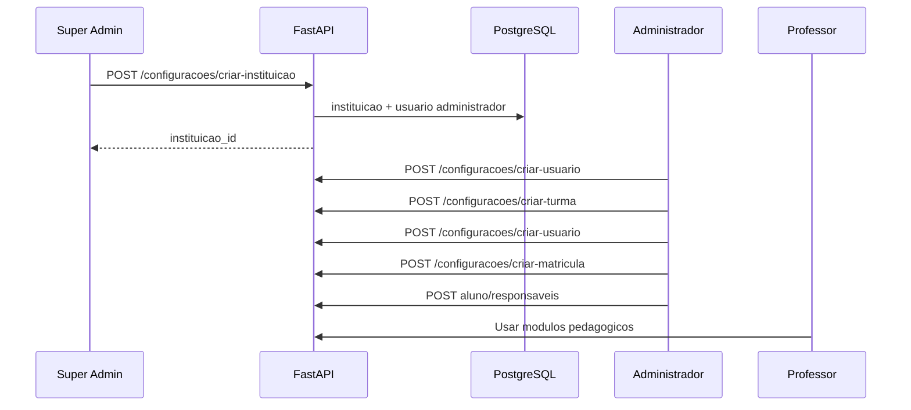

# Configurações do sistema

Módulo operacional para **escalar a plataforma**: cadastrar pessoas, turmas (salas/coortes) e relacionamentos antes de usar módulos pedagógicos.

Perfis envolvidos: **Super Admin** (plataforma) e **Administrador** (instituição). Ver [03-dominio-entidades-e-rbac.md](./03-dominio-entidades-e-rbac.md).

---

## Fluxo de onboarding da plataforma



### Passo 1 — Super Admin cria escola

1. Na home `/super-admin`, abre o modal **Nova instituição**
2. Informa `nome_fantasia`, `documento_legal` (opcional)
3. Opcionalmente cria **primeiro administrador**: e-mail, senha temporária, nome
4. `POST /configuracoes/criar-instituicao` persiste `instituicao` + `usuario_conta` (`tipo_perfil=administrador`)

### Passo 2 — Administrador configura a escola

1. Login → `/configuracoes`
2. Cadastra **professores** (conta de acesso `professor`)
3. Cadastra **turmas** (nome, ano letivo, turno, professor titular)
4. Cadastra **alunos** (conta `aluno`)
5. **Matricula** alunos nas turmas (`situacao=ativa`)
6. Cadastra **responsáveis** e vincula aos alunos (`responsavel_principal` quando único canal)

### Passo 3 — Operação pedagógica

Professores (ou administrador) usam Conteúdo, Avaliações, Comunicados e Dashboard com dados reais escopados à turma.

---

## Telas — Super Admin

### `/super-admin` (home)

| Bloco | Dados |
|-------|--------|
| Cartões | Total instituições, professores, turmas, alunos (plataforma) |
| Diretório | Instituições e usuários com filtros |
| Ações | Nova instituição, novo usuário (wizard) |

API: `GET /configuracoes/consultar-resumo-plataforma`, `GET /configuracoes/consultar-diretorio-plataforma`

Clique em usuário → `/super-admin/usuario/[usuario_id]`.

### `/super-admin/usuario/[id]`

| Bloco | Dados / ações |
|-------|----------------|
| Cabeçalho | Perfil, instituição, **Entrar como**, **Editar**, **Desativar** |
| Conta | Nome, e-mail, senha (edição SA) |
| Instituição | Select para `PUT /associar-usuario-instituicao/{id}` |
| Por perfil | Aluno: turmas/matrículas/responsáveis; Professor: turmas titulares; Responsável: alunos vinculados; Administrador: link à escola |

API: `GET /consultar-detalhe-usuario/{usuario_id}`; mutações SA listadas em [07-api-contrato-backend.md](./07-api-contrato-backend.md) §3.1.2.

### `/super-admin/instituicoes/[id]`

| Bloco | Dados / ações |
|-------|----------------|
| Cartões | Administradores, professores, turmas, alunos, responsáveis |
| Usuários | Tabela com botão **Entrar como** (impersonação) |
| Professores | Listar + criar professor (`POST /configuracoes/criar-usuario` com `instituicao_id`) |
| Turmas | Listagem filtrada por escola |

API: `GET /configuracoes/consultar-resumo-instituicao/{id}`

**Fluxo impersonação (Super Admin):**

1. Na tela da escola, clicar **Entrar como** em gestor, professor, aluno ou responsável
2. Frontend chama `POST /api/auth/assumir-sessao` → backend `POST /configuracoes/assumir-sessao/{usuario_id}`
3. Cookies de sessão passam a ser do usuário alvo; cookies do SA ficam em backup
4. Redirecionamento para home do perfil (`/configuracoes`, `/conteudo`, `/aluno/provas`, `/dashboard`)
5. Faixa amarela no topo: **Voltar ao Super Admin** → `POST /api/auth/restaurar-sessao-admin`

Credenciais demo (senha `admin123`): ver comentário em `backend/scripts/seed.py`.

Na visão **Turmas** do diretório na página da instituição, use **Gerenciar** para definir professor titular e matricular alunos em lote.

**Restrição:** Super Admin **não** acessa editor de provas nem emite comunicados como professor **sem** assumir sessão de um usuário da escola.

---

## Telas — Administrador (`/configuracoes`)

Layout com abas ou subnav:

### Professores

**Lista**
- Busca por nome/e-mail
- Botão "Novo professor"

**Formulário**
| Campo | Validação |
|-------|-----------|
| nome_exibicao | obrigatório |
| email | único na instituição |
| senha_inicial | min 8 caracteres |
| registro_funcional | opcional |
| areas_especialidade | opcional |

API: `POST /configuracoes/criar-usuario` com `tipo_perfil=professor` cria `usuario_conta` + `professor`.

**Desativar:** `status_conta=suspensa` (não apagar histórico).

### Turmas (salas de aula / coortes)

**Lista**
- Nome, ano letivo, turno, professor titular, lista `professores[]` (N:N), nº alunos

**Formulário turma**
| Campo | Validação |
|-------|-----------|
| nome | obrigatório |
| ano_letivo | obrigatório |
| turno | opcional |
| professor_titular_id | opcional; mantém coluna legada + junction `turma_professor` |

**Wizards (Configurações e SA instituição)** — etapas opcionais com toggle:
- Aluno: matrícula em uma turma após vínculo com responsável
- Professor: vínculo a uma ou mais turmas (titular por turma via checkbox)
- Turma: matricular alunos e associar vários professores (um titular)

**Verificação manual (turmas / wizards):**
1. Criar aluno sem turma; criar aluno com turma existente.
2. Criar turma sem alunos/professores; criar turma com N alunos e M professores (1 titular).
3. Criar professor sem turmas; criar professor titular em 2 turmas e colaborador em outra.
4. Na mesma turma, 2+ professores via `associar-professores-turma-lote`.
5. Admin em Configurações: matrícula e lotes de professor sem 403.
6. SA instituição: wizards aluno/professor com passos opcionais.

**Detalhe turma** `/configuracoes/turmas/[id]`
- Lista alunos matriculados (ativos)
- Ação "Matricular aluno" → modal seleciona aluno sem matrícula ativa
- `POST /configuracoes/criar-matricula`
- Ação "Encerrar matrícula" → `PUT /configuracoes/editar-matricula/{id}`

### Alunos

**Formulário**
| Campo | Validação |
|-------|-----------|
| nome_exibicao | obrigatório |
| email | único instituição |
| senha_inicial | obrigatório |
| nome_social | opcional |
| data_nascimento | opcional |
| matricula_codigo | opcional |

**Detalhe aluno** `/configuracoes/alunos/[id]`
- Turma ativa (se houver)
- Responsáveis vinculados
- Adicionar responsável existente ou criar novo
- Checkbox `responsavel_principal`

### Responsáveis

Formulário análogo ao aluno com `grau_parentesco`, `telefone`.

Vínculo: `POST /configuracoes/vincular-responsavel-aluno/{aluno_id}`

---

## Regras de integridade

| Regra | Comportamento |
|-------|---------------|
| Matrícula ativa única | 409 ao matricular aluno já ativo em outra turma |
| Turma sem alunos | Dashboard e contadores zerados — válido |
| Professor sem turma | Pode criar conteúdo institucional; comunicados exigem escopo claro |
| E-mail duplicado | 409 na mesma instituição |
| Excluir professor com turma titular | Bloquear ou exigir reassign (409) |
| Super admin sem instituição | `instituicao_id` NULL no token |

---

## Relacionamentos (diagrama operacional)

```
Instituicao
  └── Turma (professor_titular_id → Professor)
        └── Matricula (situacao=ativa) → Aluno
  └── Professor (usuario_conta)
  └── Aluno (usuario_conta)
        └── Aluno_Responsavel → Responsavel
```

---

## API resumida

Ver seção **3.2 e 3.3** em [07-api-contrato-backend.md](./07-api-contrato-backend.md).

---

## Critérios de aceite (RF-020, RF-021, RF-024)

1. Super Admin lista professores de duas instituições distintas na mesma tela com filtro
2. Administrador cria turma, matricula 3 alunos, define professor titular
3. Professor titular vê turma em `/turmas` e alunos em comunicados
4. Aluno criado consegue login e vê turma após matrícula (F5)
5. Tentativa de administrador acessar outra instituição via ID → 404

---

## Referências

- Roadmap F2: [11-roadmap-desenvolvimento.md](./11-roadmap-desenvolvimento.md#fase-f2--cadastros-e-super-admin)
- Histórias: [09-historias-usuario-gherkin.md](./09-historias-usuario-gherkin.md#épico-5--configuração-institucional)
- Status: [10-status-implementacao.md](./10-status-implementacao.md)
