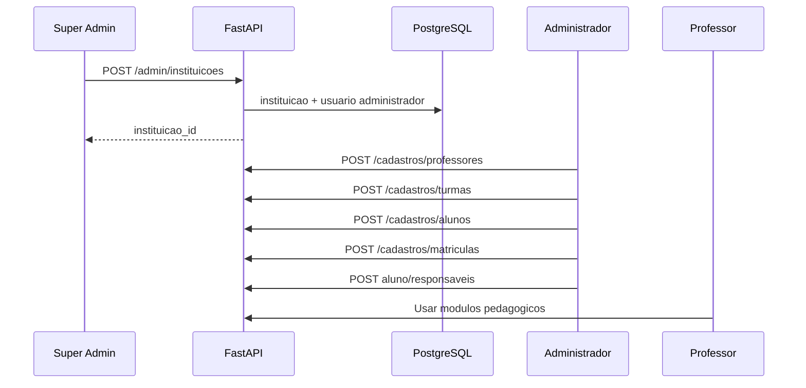

# Configurações do sistema

Módulo operacional para **escalar a plataforma**: cadastrar pessoas, turmas (salas/coortes) e relacionamentos antes de usar módulos pedagógicos.

Perfis envolvidos: **Super Admin** (plataforma) e **Administrador** (instituição). Ver [03-dominio-entidades-e-rbac.md](./03-dominio-entidades-e-rbac.md).

---

## Fluxo de onboarding da plataforma



### Passo 1 — Super Admin cria escola

1. Acessa `/super-admin/instituicoes/nova`
2. Informa `nome_fantasia`, `documento_legal` (opcional)
3. Opcionalmente cria **primeiro administrador**: e-mail, senha temporária, nome
4. `POST /admin/instituicoes` persiste `instituicao` + `usuario_conta` (`tipo_perfil=administrador`)

### Passo 2 — Administrador configura a escola

1. Login → `/configuracoes`
2. Cadastra **professores** (conta de acesso `professor`)
3. Cadastra **turmas** (nome, ano letivo, turno, professor titular)
4. Cadastra **alunos** (conta `aluno`)
5. **Matricula** alunos nas turmas (`situacao=ativa`)
6. Cadastra **responsáveis** e vincula aos alunos (`responsavel_principal` quando único canal)

### Passo 3 — Operação pedagógica

Professores (ou administrador) usam Conteúdo, Avaliações, Comunicados e Dashboard com dados reais escopados à turma.

---

## Telas — Super Admin

### `/super-admin` (home)

| Bloco | Dados |
|-------|--------|
| Cartões | Total instituições, professores, turmas, alunos (plataforma) |
| Ação rápida | Nova instituição |

API: `GET /super-admin/resumo`

### `/super-admin/instituicoes`

| Coluna | Ação |
|--------|------|
| Nome | Link detalhe |
| Documento | — |
| Qtd turmas / professores | Derivado |
| Status | ativa/suspensa |
| Ações | Editar |

Filtros: nome, status. Paginação cursor.

### `/super-admin/professores`

| Coluna | Notas |
|--------|--------|
| Nome | — |
| E-mail | — |
| Instituição | FK nome_fantasia |
| Turmas titular | Contagem |

Query: `?instituicao_id=` (opcional). API: `GET /super-admin/professores`

### `/super-admin/turmas`

Mesma lógica com `GET /super-admin/turmas`.

**Restrição:** Super Admin **não** acessa editor de provas nem emite comunicados como professor.

---

## Telas — Administrador (`/configuracoes`)

Layout com abas ou subnav:

### Professores

**Lista**
- Busca por nome/e-mail
- Botão "Novo professor"

**Formulário**
| Campo | Validação |
|-------|-----------|
| nome_exibicao | obrigatório |
| email | único na instituição |
| senha_inicial | min 8 caracteres |
| registro_funcional | opcional |
| areas_especialidade | opcional |

API: `POST /cadastros/professores` cria `usuario_conta` + `professor`.

**Desativar:** `status_conta=suspensa` (não apagar histórico).

### Turmas (salas de aula / coortes)

**Lista**
- Nome, ano letivo, turno, professor titular, nº alunos

**Formulário turma**
| Campo | Validação |
|-------|-----------|
| nome | obrigatório |
| ano_letivo | obrigatório |
| turno | opcional |
| professor_titular_id | opcional no MVP, recomendado |

**Detalhe turma** `/configuracoes/turmas/[id]`
- Lista alunos matriculados (ativos)
- Ação "Matricular aluno" → modal seleciona aluno sem matrícula ativa
- `POST /cadastros/matriculas`
- Ação "Encerrar matrícula" → `PATCH /cadastros/matriculas/{id}`

### Alunos

**Formulário**
| Campo | Validação |
|-------|-----------|
| nome_exibicao | obrigatório |
| email | único instituição |
| senha_inicial | obrigatório |
| nome_social | opcional |
| data_nascimento | opcional |
| matricula_codigo | opcional |

**Detalhe aluno** `/configuracoes/alunos/[id]`
- Turma ativa (se houver)
- Responsáveis vinculados
- Adicionar responsável existente ou criar novo
- Checkbox `responsavel_principal`

### Responsáveis

Formulário análogo ao aluno com `grau_parentesco`, `telefone`.

Vínculo: `POST /cadastros/alunos/{id}/responsaveis`

---

## Regras de integridade

| Regra | Comportamento |
|-------|---------------|
| Matrícula ativa única | 409 ao matricular aluno já ativo em outra turma |
| Turma sem alunos | Dashboard e contadores zerados — válido |
| Professor sem turma | Pode criar conteúdo institucional; comunicados exigem escopo claro |
| E-mail duplicado | 409 na mesma instituição |
| Excluir professor com turma titular | Bloquear ou exigir reassign (409) |
| Super admin sem instituição | `instituicao_id` NULL no token |

---

## Relacionamentos (diagrama operacional)

```
Instituicao
  └── Turma (professor_titular_id → Professor)
        └── Matricula (situacao=ativa) → Aluno
  └── Professor (usuario_conta)
  └── Aluno (usuario_conta)
        └── Aluno_Responsavel → Responsavel
```

---

## API resumida

Ver seção **3.2 e 3.3** em [07-api-contrato-backend.md](./07-api-contrato-backend.md).

---

## Critérios de aceite (RF-020, RF-021, RF-024)

1. Super Admin lista professores de duas instituições distintas na mesma tela com filtro
2. Administrador cria turma, matricula 3 alunos, define professor titular
3. Professor titular vê turma em `/turmas` e alunos em comunicados
4. Aluno criado consegue login e vê turma após matrícula (F5)
5. Tentativa de administrador acessar outra instituição via ID → 404

---

## Referências

- Roadmap F2: [11-roadmap-desenvolvimento.md](./11-roadmap-desenvolvimento.md#fase-f2--cadastros-e-super-admin)
- Histórias: [09-historias-usuario-gherkin.md](./09-historias-usuario-gherkin.md#épico-5--configuração-institucional)
- Status: [10-status-implementacao.md](./10-status-implementacao.md)
