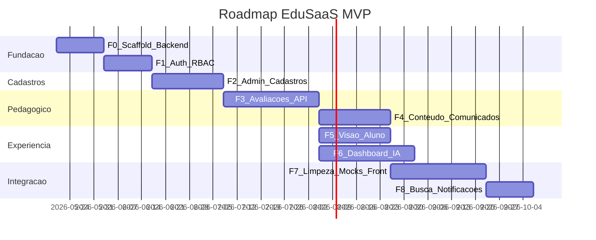

# Roadmap de desenvolvimento

Plano sequencial do **backend zero** até **integração completa** no frontend, com remoção de mocks e telas finais por perfil.

**Horizonte:** MVP — estimativas em dias úteis são orientativas.

---

## Visão das fases

| Fase | Nome | Duração ~ | Dependências |
|------|------|-----------|--------------|
| F0 | Scaffold backend + BD | 2 sem | — |
| F1 | Auth + RBAC + login | 2 sem | F0 |
| F2 | Cadastros + Super Admin | 3 sem | F1 |
| F3 | Avaliações E2E | 4 sem | F2 |
| F4 | Conteúdo + comunicados | 3 sem | F3 |
| F5 | Visão aluno | 3 sem | F3 (paralelo F4) |
| F6 | Dashboard + IA | 4 sem | F3 (paralelo F4/F5) |
| F7 | Limpeza mocks + hardening | 4 sem | F4 |
| F8 | Busca + notificações | 2 sem | F7 |

---

## Fase F0 — Scaffold backend e banco

### Objetivo

Criar pasta `backend/` executável via Docker Compose (`docker compose up`).

### Entregáveis backend

- [ ] `backend/pyproject.toml` ou `requirements.txt`
- [ ] `backend/app/main.py` — FastAPI, CORS, health `/health`
- [ ] SQLAlchemy models — 27 tabelas ([04-modelo-de-dados.md](./04-modelo-de-dados.md))
- [ ] `tipo_perfil`: super_admin, administrador, professor, aluno, responsavel
- [ ] Alembic `versions/001_initial.py`
- [ ] `backend/Dockerfile.dev`
- [ ] Seed script opcional (instituição demo)

### Entregáveis ops

- [x] `docker compose up` sobe db + backend + frontend
- [ ] Variáveis em `backend/.env.example`

### Critérios de saída

- Migrations aplicam sem erro em Postgres vazio
- `GET /health` → 200
- Tabelas listadas conferem com documentação

### Frontend

Nenhuma alteração obrigatória.

---

## Fase F1 — Auth, RBAC e login

### Objetivo

Autenticação JWT e guards de rota; base para todos os perfis.

### Backend

- [x] `POST /auth/login`, `/refresh`, `/logout`, `GET /auth/me`
- [x] `PATCH /users/me/preferences`
- [x] Middleware: extrair claims, validar perfil por router (`api/deps.py`)
- [ ] Testes automatizados: 401 sem token, 403 perfil errado

### Frontend

- [ ] `app/login/page.tsx`
- [ ] `lib/api/client.ts`, `lib/api/auth.ts`
- [ ] `middleware.ts` — rotas públicas/protegidas
- [ ] Cabeçalho: dados reais de `/auth/me`
- [ ] Sidebar: preparar estrutura `navPorPerfil` (ainda pode mostrar 4 itens professor)

### Mapeamento endpoint → tela

| Endpoint | Tela |
|----------|------|
| `POST /auth/login` | `/login` |
| `GET /auth/me` | `cabecalho.tsx` |
| `PATCH /users/me/preferences` | `alternador-tema.tsx` |

### Critérios de saída

- RF-018, RF-016 (parcial) atendidos
- Usuário seed loga e vê nome real no cabeçalho
- Rotas `(app)/*` exigem autenticação

**RF:** RF-002 (base), RF-018, RF-019 (parcial)

---

## Fase F2 — Cadastros e Super Admin

### Objetivo

Configurar escola antes do uso pedagógico; visão cross-tenant.

### Backend

- [x] Rotas `/admin/instituicoes`, `/super-admin/*`
- [x] Rotas `/cadastros/*` (professores, alunos, responsáveis, turmas, matrículas)
- [x] RN: e-mail único por instituição; matrícula ativa única
- [ ] Testes IDOR entre instituições

### Frontend

- [ ] `app/(app)/configuracoes/**`
- [ ] `app/super-admin/**`
- [ ] Nav condicional: Configurações (Adm), Super Admin (SA)

### Mapeamento (amostra)

| Endpoint | Tela |
|----------|------|
| `POST /admin/instituicoes` | `/super-admin/instituicoes/nova` |
| `GET /cadastros/turmas` | `/configuracoes/turmas` |
| `POST /cadastros/matriculas` | `/configuracoes/turmas/[id]` |

### Critérios de saída

- Super Admin cria instituição + administrador
- Administrador cadastra turma com 2+ alunos e professor titular
- RF-020, RF-021, RF-024 → **Integrado**

---

## Fase F3 — Avaliações end-to-end

### Objetivo

Persistir hierarquia matéria→questão; publicar/encerrar; submissão aluno (API).

### Backend

- [x] Endpoints `/avaliacoes/*` exceto chat (seção 3.6 do [07-api](./07-api-contrato-backend.md))
- [x] `/aluno/avaliacoes/*`, `/aluno/submissoes/*`
- [x] Contadores derivados em pastas
- [x] Correção objetiva síncrona em `enviar` (MVP)
- [ ] Chat IA: `IAController.py` (próxima fase)

### Frontend

- [ ] Remover dependência de seed em `dados.ts` para listagem
- [ ] `useAvaliacoesApi` substitui `ProvedorAvaliacoes` (ou híbrido com cache)
- [ ] Editor chama `salvar-rascunho`, `publicar`, `encerrar`
- [ ] Debounce auto-save (RF-007)

### Critérios de saída

- Professor cria matéria, pasta, avaliação, publica — sobrevive reload
- Aluno (API via curl/Postman) submete prova — nota MCQ calculada
- RF-005–009, RF-017 → Integrado (UI professor); RF-022 API pronta

---

## Fase F4 — Conteúdo e comunicados

### Objetivo

Materiais didáticos e comunicados com persistência e upload.

### Backend

- [x] `/conteudo/*`, `/uploads/presign` (stub)
- [x] `/comunicados/*` + expansão destinatários + `comunicado_leitura`
- [ ] Notificações automáticas ao publicar comunicado

### Frontend

- [ ] `modulo-conteudo.tsx` → API
- [ ] `modulo-comunicados.tsx` → API
- [ ] Upload via presign

### Critérios de saída

- RF-003, RF-004, RF-010, RF-011 → Integrado
- Comunicado para turma aparece só para destinatários corretos

---

## Fase F5 — Visão aluno

### Objetivo

Jornada completa do aluno no frontend.

### Backend

- [x] Escopo `/aluno/*` e materiais GET autorizados (revisão contínua no front)

### Frontend

- [ ] Route group `(aluno)/`
- [ ] `/aluno/provas`, `/aluno/provas/[id]`
- [ ] `ResolverAvaliacao` component
- [ ] Sidebar aluno: Conteúdo, Minhas provas, Comunicados
- [ ] Redirect pós-login aluno → `/aluno/provas`

### Critérios de saída

- RF-022 → Concluído
- RF-019 → Concluído para aluno

---

## Fase F6 — Dashboard e IA

### Objetivo

Painel com dados reais; relatório IA assíncrono.

### Backend

- [x] `GET /dashboard/resumo` (agregações + `dashboard_fato_desempenho`)
- [x] `GET /search`, `/notificacoes*`
- [x] Escopo responsável: filtro dependentes (parcial)
- [ ] Fila `relatorio_ia` (stub LLM OK)
- [ ] `GET /submissoes/{id}/relatorio-ia` — `IAController.py`

### Frontend

- [ ] `modulo-dashboard.tsx` consome API
- [ ] Visão responsável com seletor de dependente

### Critérios de saída

- RF-012, RF-013, RF-014, RF-023 → Integrado
- Após envio de prova, relatório aparece (ou status pendente)

---

## Fase F7 — Limpeza de mocks e hardening

### Objetivo

Remover dados locais; testes de segurança e regressão.

### Backend

- [ ] Suite integração RBAC (matriz Apêndice A)
- [ ] Testes IDOR, 409 submissão duplicada
- [ ] Documentar OpenAPI `/docs`

### Frontend

- [ ] Remover `lib/avaliacoes/dados.ts` seed de produção
- [ ] Remover `ProvedorAvaliacoes` se obsoleto
- [ ] `ignoreBuildErrors: false` no next.config quando estável
- [ ] Administrador e professor: paridade nas rotas `/avaliacoes`

### Critérios de saída

- Nenhum módulo pedagógico usa mock em runtime
- [10-status-implementacao.md](./10-status-implementacao.md) atualizado: ≥70% produto E2E

---

## Fase F8 — Busca e notificações

### Objetivo

Cabeçalho global funcional (RF-001 completo).

### Backend

- [ ] `GET /search` com full-text ou ILIKE
- [ ] `GET/PATCH /notificacoes*`

### Frontend

- [ ] Handler busca no `cabecalho.tsx`
- [ ] Painel notificações com dados API

### Critérios de saída

- RF-001 → Concluído
- Busca retorna grupos e deep links válidos

---

## Tabela consolidada endpoint → tela → fase

| Endpoint | Tela | Fase |
|----------|------|------|
| `POST /auth/login` | `/login` | F1 |
| `GET /auth/me` | Cabeçalho | F1 |
| `POST /admin/instituicoes` | `/super-admin/instituicoes/nova` | F2 |
| `GET /super-admin/professores` | `/super-admin/professores` | F2 |
| `POST /cadastros/turmas` | `/configuracoes/turmas` | F2 |
| `POST /cadastros/matriculas` | `/configuracoes/turmas/[id]` | F2 |
| `GET /avaliacoes/materias` | `/avaliacoes` | F3 |
| `POST /avaliacoes/.../publicar` | Editor avaliação | F3 |
| `GET /aluno/avaliacoes/disponiveis` | `/aluno/provas` | F5 |
| `POST /aluno/submissoes/.../enviar` | `/aluno/provas/[id]` | F5 |
| `GET /conteudo/pastas` | `/conteudo` | F4 |
| `GET /comunicados` | `/comunicados` | F4 |
| `GET /dashboard/resumo` | `/dashboard` | F6 |
| `GET /search` | Cabeçalho busca | F8 |
| `GET /notificacoes` | Cabeçalho sino | F8 |

---

## Riscos e mitigação

| Risco | Mitigação |
|-------|-----------|
| `modulo-avaliacoes.tsx` monolítico | Extrair editor e lista aluno na F3/F5 |
| Contadores pasta divergentes | Views materializadas + job reconciliação |
| LLM indisponível | Stub `relatorio_ia` com texto placeholder |
| Multi-tenant vazamento | Testes automatizados F2/F7 |

---

## Referências

- Contrato API: [07-api-contrato-backend.md](./07-api-contrato-backend.md)
- Status atual: [10-status-implementacao.md](./10-status-implementacao.md)
- Configurações: [08-configuracoes-sistema.md](./08-configuracoes-sistema.md)
