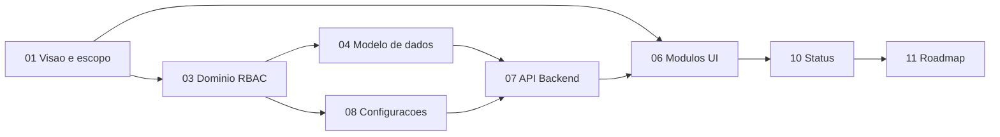

# Documentação EduSaaS

Documentação operacional para engenharia do **Sistema de Gestão e Observabilidade Educacional (MVP)**. Organiza, estende e torna executável a especificação de produto existente.

## Fontes canônicas

| Documento | Papel |
|-----------|--------|
| [frontend/docs/especificacao-de-requisitos.txt](../frontend/docs/especificacao-de-requisitos.txt) | Especificação de produto e arquitetura alvo (texto acadêmico completo) |
| [roadmap-backend.txt](../roadmap-backend.txt) | Contrato API original (legado); conteúdo migrado para [07-api-contrato-backend.md](./07-api-contrato-backend.md) |
| Código frontend em `frontend/` | Implementação atual (UI professor com mocks) |

**A partir desta versão, `Docs/` é a fonte canônica para desenvolvimento.** O arquivo `roadmap-backend.txt` permanece no repositório como referência histórica; alterações futuras de API devem ser feitas em `07-api-contrato-backend.md`.

## Mapa de leitura

### Por objetivo

| Quero… | Leia |
|--------|------|
| Entender o produto e limites do MVP | [01-visao-produto-e-escopo-mvp.md](./01-visao-produto-e-escopo-mvp.md) |
| Ver stack, deploy e integração | [02-arquitetura-tecnologia.md](./02-arquitetura-tecnologia.md) |
| Definir perfis e permissões | [03-dominio-entidades-e-rbac.md](./03-dominio-entidades-e-rbac.md) |
| Modelar banco / migrations | [04-modelo-de-dados.md](./04-modelo-de-dados.md) |
| Rastrear requisitos (RF) | [05-requisitos-funcionais.md](./05-requisitos-funcionais.md) |
| Implementar telas por papel | [06-modulos-interface-por-perfil.md](./06-modulos-interface-por-perfil.md) |
| Implementar FastAPI | [07-api-contrato-backend.md](./07-api-contrato-backend.md) |
| Configurar escola / super admin | [08-configuracoes-sistema.md](./08-configuracoes-sistema.md) |
| Escrever testes BDD | [09-historias-usuario-gherkin.md](./09-historias-usuario-gherkin.md) |
| Saber o que falta fazer | [10-status-implementacao.md](./10-status-implementacao.md) |
| Planejar sprints | [11-roadmap-desenvolvimento.md](./11-roadmap-desenvolvimento.md) |
| Integrar frontend com API | [12-integracao-frontend-api.md](./12-integracao-frontend-api.md) |

## Glossário rápido

| Termo | Significado |
|-------|-------------|
| **Tenant** | Instituição de ensino (`instituicao`); raiz de isolamento de dados |
| **Turma** | Coorte pedagógica (equivalente a “sala de aula” no cadastro operacional) |
| **Matrícula** | Vínculo aluno ↔ turma com situação ativa/encerrada |
| **Pasta de avaliações** | Agrupador de provas dentro de um assunto curricular |
| **Mock** | Dados em memória no frontend, sem persistência no servidor |

## Índice de documentos

1. [01-visao-produto-e-escopo-mvp.md](./01-visao-produto-e-escopo-mvp.md)
2. [02-arquitetura-tecnologia.md](./02-arquitetura-tecnologia.md)
3. [03-dominio-entidades-e-rbac.md](./03-dominio-entidades-e-rbac.md)
4. [04-modelo-de-dados.md](./04-modelo-de-dados.md)
5. [05-requisitos-funcionais.md](./05-requisitos-funcionais.md)
6. [06-modulos-interface-por-perfil.md](./06-modulos-interface-por-perfil.md)
7. [07-api-contrato-backend.md](./07-api-contrato-backend.md)
8. [08-configuracoes-sistema.md](./08-configuracoes-sistema.md)
9. [09-historias-usuario-gherkin.md](./09-historias-usuario-gherkin.md)
10. [10-status-implementacao.md](./10-status-implementacao.md)
11. [11-roadmap-desenvolvimento.md](./11-roadmap-desenvolvimento.md)
12. [12-integracao-frontend-api.md](./12-integracao-frontend-api.md)

## Manutenção

Atualize [10-status-implementacao.md](./10-status-implementacao.md) a cada entrega relevante (merge de feature que altere UI, API ou RF). Atualize [07-api-contrato-backend.md](./07-api-contrato-backend.md) quando contratos REST mudarem.
